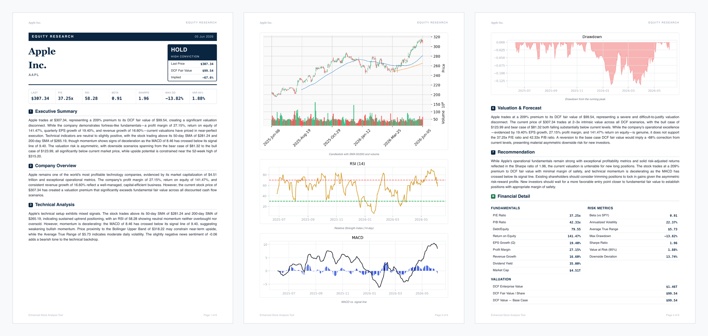
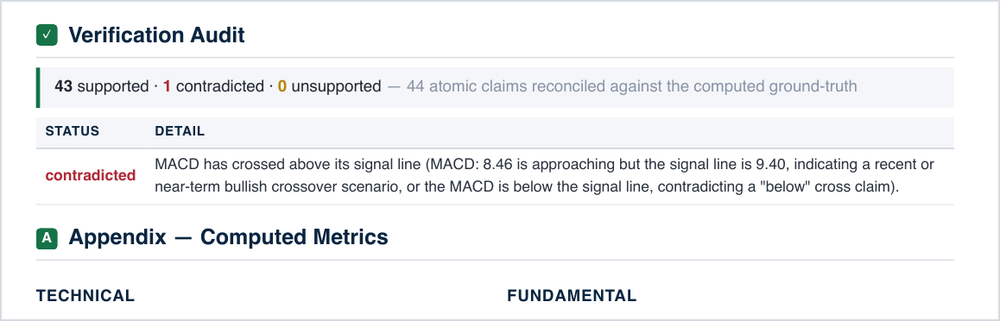
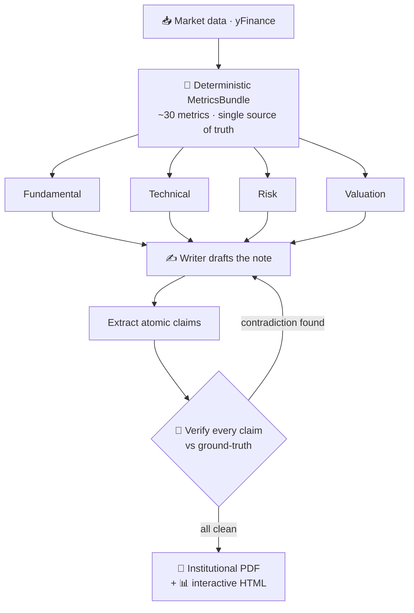

<h1 align="center">📈 Enhanced Stock Analysis Tool</h1>

<p align="center"><b>AI equity research that fact-checks itself.</b></p>

<p align="center">
A crew of LangGraph agents writes an institutional-style note — and a <b>verification gate</b> reconciles <i>every number</i> before it reaches the page.
</p>

<p align="center">
  
  
  
  
  
</p>

<p align="center">
  
</p>
<p align="center"><sub>↑ Generated by this tool — see the full <a href="samples/AAPL_report.pdf"><b>6-page AAPL report (PDF)</b></a></sub></p>

---

## ✨ Why it's different

Most "AI report" tools let the model write numbers straight onto the page — and models make them up. This one **can't**.

> Numbers are computed **first**; agents may only reason over that ground-truth, and a gate rewrites the note until every claim checks out.

<p align="center">
  
</p>
<p align="center"><sub>Live AAPL run on Claude Haiku 4.5 — the gate auto-flagged a wrong "bullish MACD crossover" claim (MACD 8.46 was <i>below</i> its 9.40 signal line).</sub></p>

## 🔁 How it works



| Stage | What happens |
|---|---|
| **Ground-truth** | `MetricsBundle` computes ~30 deterministic metrics (technical · fundamental · risk · valuation · sentiment). |
| **Analyst crew** | Four specialist agents run in parallel, then a writer drafts a rated note. |
| **Verification gate** | Numbers checked **programmatically** (scale-aware, ±1%); prose goes to a **grounded LLM judge** (sees metrics only). Contradictions → bounded rewrite loop (`max_revisions=2`). |
| **Render** | WeasyPrint → print-quality PDF · Plotly → self-contained interactive dashboard. |

## 🚀 Quickstart

```bash
# 1 · native libraries for PDF rendering (macOS)
brew install pango cairo gdk-pixbuf libffi
#   Debian/Ubuntu: apt-get install libpango-1.0-0 libpangocairo-1.0-0 libgdk-pixbuf2.0-0 libffi-dev

# 2 · install
python3 -m venv .venv && source .venv/bin/activate
pip install -e ".[dev]"

# 3 · add an API key  (Gemini for dev · Anthropic for the final run)
cp .env.example .env          # set GOOGLE_API_KEY and/or ANTHROPIC_API_KEY

# 4 · run
stock-analyzer analyze AAPL --period 1y --out out --benchmark SPY
```

Outputs land in `out/`:

| File | What |
|---|---|
| `AAPL_report.pdf` | the institutional research note + verification audit |
| `AAPL_dashboard.html` | self-contained interactive dashboard (open in any browser) |
| `charts/` | the individual PNG charts embedded in the PDF |

## 🧠 LLM providers

Swap with one env var — both run through LangChain's `.with_structured_output()`.

| `LLM_PROVIDER` | Default model | Use for |
|---|---|---|
| `gemini` *(default)* | `gemini-2.5-flash-lite` | dev / iteration — fast, cheap, free-tier-friendly |
| `anthropic` | `claude-haiku-4-5` | production — cheapest Claude (`MODEL=claude-opus-4-8` for top reasoning) |

> 💡 One report ≈ **10–15 LLM calls**. Gemini free-tier quotas are per-model/per-day — `gemini-2.5-flash-lite` has the most generous, and the client auto-throttles under the rate cap.

## 📑 Inside the report

| Page | Contents |
|---|---|
| **Cover** | Rating box + 7-metric key-stats panel |
| **Charts** | Candlestick + SMA/volume, RSI, MACD, returns, drawdown |
| **Tables** | Fundamentals, risk & valuation |
| **DCF** | Enterprise-value sensitivity grid (growth × WACC) |
| **Appendix** | Headlines, verification audit, full metrics, disclosures |

<sub>_Running headers + page numbers throughout._</sub>

## 🗂️ Architecture

<details>
<summary><b>Module map</b> — click to expand</summary>

```
src/stock_analyzer/
├── config.py              Settings (pydantic-settings; reads .env)
├── tokens.py              shared design tokens (colors, fonts)
├── pipeline.py            run_analysis() — top-level orchestrator
├── cli.py                 Typer CLI (the `stock-analyzer` entrypoint)
├── data/
│   ├── base.py            DataProvider protocol + DataUnavailableError
│   ├── models.py          PriceHistory, Fundamentals, NewsItem
│   ├── yfinance_provider.py
│   └── fmp_provider.py    optional provider stub (extend as needed)
├── metrics/
│   ├── value.py           MetricValue (unit-aware display, NaN/inf guard)
│   ├── bundle.py          MetricsBundle.from_data() — the ground truth
│   ├── technical.py       SMA/EMA, RSI, MACD, Bollinger, support/resistance
│   ├── fundamental.py     P/E, P/B, ROE, margins, growth, dividend yield
│   ├── risk.py            beta, volatility, ATR, max drawdown, Sharpe, VaR
│   ├── valuation.py       DCF, per-share fair value, bull/base/bear, sensitivity
│   └── sentiment.py       VADER news sentiment
├── charts/
│   ├── theme.py           matplotlib theme from shared tokens
│   └── builders.py        candlestick+volume, price/MA, RSI, MACD, returns, drawdown
├── agents/
│   ├── state.py           AnalysisState (TypedDict) + Pydantic schemas
│   ├── llm.py             make_llm() (provider-swappable), structured(), grounding_block()
│   ├── analysts.py        make_analyst_node() for each role
│   ├── writer.py          make_writer_node()
│   └── graph.py           build_graph() — LangGraph StateGraph + verification loop
├── verification/
│   ├── models.py          Claim, Verdict, JudgeVerdict, VerificationAudit
│   ├── extract.py         claim-extraction node
│   ├── reconcile.py       scale-aware numeric reconciliation + the gate
│   └── judge.py           grounded LLM judge + audit assembly
└── report/
    ├── assemble.py        build_context() — merges draft + ground-truth + charts
    ├── pdf.py             render_pdf() via WeasyPrint + Jinja2
    ├── html_dashboard.py  render_dashboard() via Plotly
    └── templates/         report.html.j2 + styles.css
```

**Design docs:** [`docs/design/`](docs/design/) · [implementation plan](docs/superpowers/plans/2026-06-05-stock-analyzer-revamp.md)

</details>

**Stack:** Python 3.11+ · LangGraph · LangChain (Anthropic / Gemini) · Pydantic v2 · pandas/numpy · matplotlib + mplfinance · Plotly · Jinja2 · WeasyPrint · Typer · VADER · yFinance

## 🧪 Tests

```bash
pytest          # 43 tests — all passing
```

The suite is **fully offline** — network and LLM calls are faked in-process, so no API keys needed.

## 🗄️ Legacy

The original CrewAI + Groq implementation is preserved under [`legacy/`](legacy/) for reference — the current tool is a ground-up rewrite.

---

> ⚠️ **Not investment advice.** For research and educational purposes only. The narrative is LLM-generated; numbers are verified, but consult a qualified financial advisor before investing.

📄 Released under the [MIT License](LICENSE.md).
